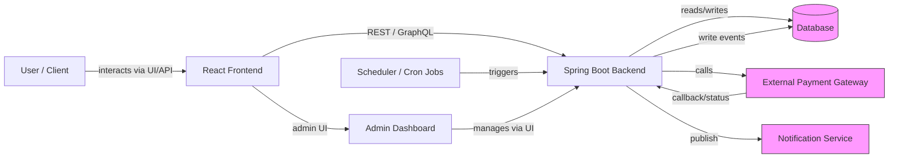

# PaymentProcessing

Comprehensive payment processing platform combining a React frontend and a Spring Boot backend. This repository contains the full source, database scripts, and a multi-stage Dockerfile to build and run the application.

## Features

- Payment initiation: one-time and scheduled payments with validation and retry handling.
- Beneficiary management: add, edit, and remove beneficiaries with IFSC/account link support.
- Refunds & disputes: request refunds and view refund history.
- Transaction history & reporting: view, filter, and export transaction records.
- Scheduling: scheduled payments and a scheduler component to execute them.
- Admin dashboard: administrative views for refunds, users, and system monitoring.
- Authentication & sessions: secure user sessions and basic auth/session management.
- Notifications: basic hooks to send notifications (email/SMS) after events.
- Frontend support: React SPA with a dev server and production build served by Spring Boot.
- Dockerized build: multi-stage Dockerfile to produce a compact runtime image.

## Flowchart

High-level flow of the application (frontend → backend → database / external services):



---

## Project overview

PaymentProcessing offers core payment flows for customers and administrators, including payment initiation, scheduling, refunds, beneficiary management, and transaction history. The frontend is a React app located in the `frontend` folder; the backend is a Maven Spring Boot service in `src/main/java` and `src/main/resources`.

## Architecture

- Frontend: React (create-react-app or similar), served as static files from Spring Boot in production.
- Backend: Spring Boot application packaged as an executable JAR using Maven.
- Database: SQL scripts provided under `database/` to create schema and seed sample data.
- Containerization: Multi-stage Dockerfile builds the frontend and backend and produces a runtime image.

## Repository structure

- [Dockerfile](Dockerfile) - multi-stage build for frontend + backend
- [pom.xml](pom.xml) - Maven project file
- [frontend](frontend) - React application (package.json, source files)
- [src/main/resources/application.properties](src/main/resources/application.properties) - Spring Boot config
- [database](database) - SQL scripts to create schema and sample data
- [target](target) - build outputs (generated after `mvn package`)

## Prerequisites

- Java 17 (JDK) for development and Maven builds.
- Maven 3.6+ (or use the included `mvnw` / `mvnw.cmd`).
- Node.js 16+ (Node 18 recommended) and npm for frontend development.
- Docker & Docker Compose (optional) for containerized builds and runs.

## Local development

Note: The project uses a two-part development workflow (frontend + backend). You can run them independently for faster development.

Backend (Spring Boot)

1. Build and run with Maven (using wrapper if available):

```bash
# Build
./mvnw -B -DskipTests package

# Run (from project root)
java -jar target/*.jar
```

2. Alternatively, run via Maven directly:

```bash
mvn spring-boot:run
```

Frontend (React)

1. Install dependencies and run dev server:

```bash
cd frontend
npm install --legacy-peer-deps
npm start
```

2. The frontend dev server typically runs on port 3000 and proxies API requests to the backend in development. If proxying is not configured, update the frontend dev config or use a reverse proxy.

## Build & run with Docker

This repository contains a multi-stage Dockerfile that builds the frontend and backend, then produces a minimal runtime image.

Build the Docker image:

```bash
docker build -t paymentprocessing:latest .
```

Run the container (exposes port 8080):

```bash
docker run -p 8080:8080 --name paymentprocessing paymentprocessing:latest
```

Notes on the Dockerfile

- Frontend stage: builds the React app using `node:18` and copies the `build/` output into the backend resources so Spring serves the static files.
- Backend stage: uses `maven:3.9.4-eclipse-temurin-17` to build the Spring Boot jar.
- Runtime stage: uses a slim JRE image `eclipse-temurin:17-jre-jammy` and runs the packaged jar.

## Configuration

- Primary Spring configuration lives in `src/main/resources/application.properties` and in `target/classes/application.properties` after build. Typical settings include datasource URL, username, password, server port, and any API keys.

Recommended environment variables (examples; check `application.properties` for exact keys):

```properties
# Example environment overrides
SPRING_DATASOURCE_URL=jdbc:postgresql://localhost:5432/paymentdb
SPRING_DATASOURCE_USERNAME=paymentuser
SPRING_DATASOURCE_PASSWORD=secret
SERVER_PORT=8080
```

When running with Docker, pass environment variables with `-e` flags or via a Docker Compose file.

## Database

- SQL schema and migration scripts are in the `database/` folder. Files of interest:
  - [database/create_database.sql](database/create_database.sql)
  - [database/SampleData.sql](database/SampleData.sql)
  - Other table scripts: `customer.sql`, `payment.sql`, `beneficiary.sql`, etc.

Setup a local Postgres (or your RDBMS of choice), then apply the SQL scripts in order. Example with `psql`:

```bash
# create DB and user per create_database.sql or manually
psql -U postgres -f database/create_database.sql
psql -U paymentuser -d paymentdb -f database/SampleData.sql
```

Note: The `application.properties` file contains the datasource URL and credentials; ensure they match your DB setup.

## Testing

- Backend unit/integration tests (if present) run with Maven:

```bash
./mvnw test
```

- Frontend tests run via npm (Jest/React Testing Library):

```bash
cd frontend
npm test
```

## Troubleshooting

- Build fails due to missing Node modules: run `npm install` in `frontend` and re-run the Docker build.
- Database connection errors: verify `SPRING_DATASOURCE_URL`, username, password, and that the DB is reachable from the app container.
- Port conflicts: ensure `8080` (backend) and `3000` (frontend dev server) are free or change ports in configs.

Logs
- For the Spring Boot app, logs are printed to stdout; when running with Docker use `docker logs -f paymentprocessing`.

## Contribution

Contributions are welcome. Suggested workflow:

1. Fork the repository.
2. Create a feature branch: `git checkout -b feature/your-feature`.
3. Add tests and documentation for your changes.
4. Open a pull request with a clear description.

Coding conventions
- Java: follow existing package and naming conventions; run static checks if configured.
- JavaScript/React: follow existing project linting/formatting rules if present.

## License & Contact

This project does not include a specific license file. Add a `LICENSE` file if you intend to open-source it. For internal use, follow your organization's policies.

For questions about this repository, contact the maintainers or open an issue/pr in your source control system.

---

### Quick references

- Build backend: `./mvnw -B -DskipTests package`
- Run backend jar: `java -jar target/*.jar`
- Build frontend: `cd frontend && npm install && npm run build`
- Build Docker: `docker build -t paymentprocessing:latest .`
